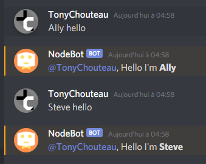

# **Discord NodeBot Documentation**

## Go back :

[README.MD](../../README.md)

##

Link to join the Discord test server :

[Click here to join](https://discord.gg/FUr7sZ)

## **Commands**

Ping command to know which bot is connected :

```
!who
```


## **Talk with the bots**

Use this structure to talk with a bot :

```
<botName> <message>
```
Example :

```
Ally hello
```



## **Ask bot which script it use**

In each .rive script there is a command to know which script is used :

```
<botName> script <n>
```
* n an integer 

In this example, Steve doesn't recognize the script 2 but Ally does :


